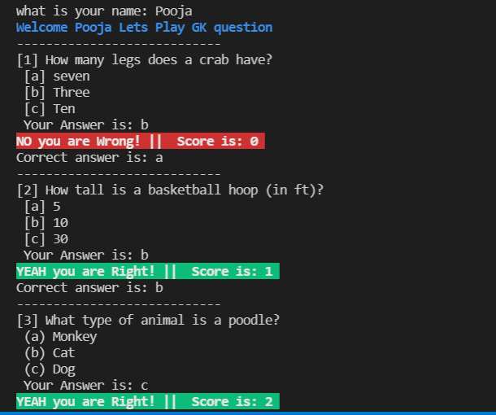

# Quiz - CLI - APP

MARK 2 - Created using Javascript

### Features:

-   Takes users name and greets user
-   Highlights important text with different color and background
-   Shows question with multiple option
-   Takes answer from user and check whether correct or not and updates the score
-   shows final result and highest score after the quiz is complete

### Package used

-   readline-sync: for taking input from user on console.
-   chalk: to decorate the CLI output with colors and text styles.

### Snapshot

### Thanks for going through my project please reach out to me on twitter if you want to give any feedback

